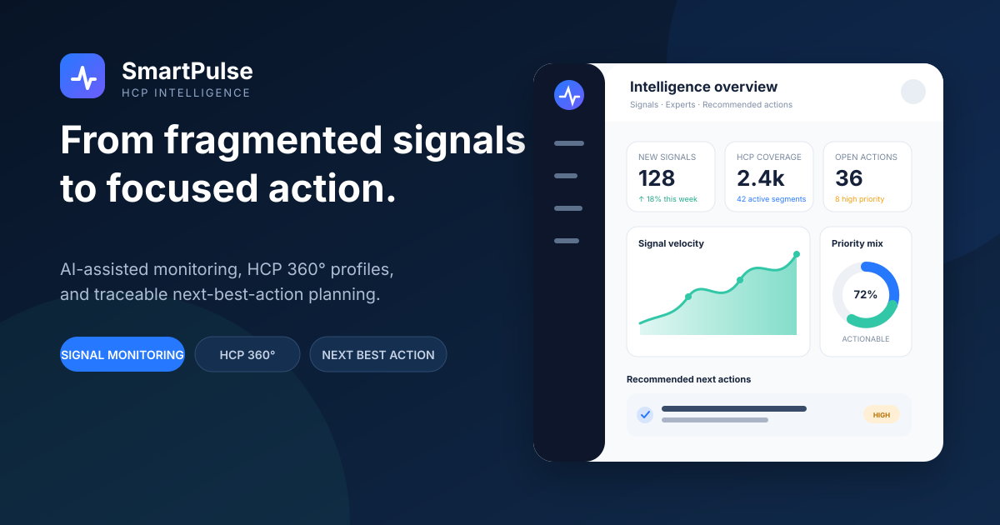
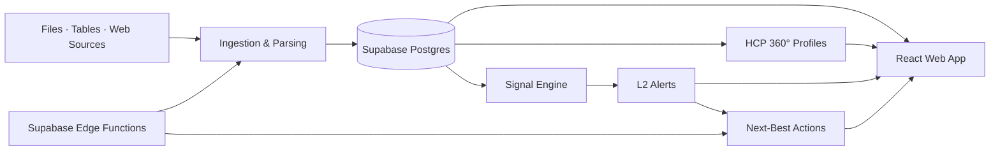

# SmartPulse

<p align="center">
  <strong>Healthcare intelligence that turns fragmented HCP signals into focused, traceable action.</strong>
</p>

<p align="center">
  
</p>

<p align="center">
  
  
  
  
  
</p>

## Product Overview

SmartPulse is a product and engineering case study for medical affairs and pharmaceutical marketing teams. It consolidates healthcare professional (HCP) activity, detects meaningful changes, builds 360° expert profiles, and converts signals into explainable next-best-action recommendations.

The product is designed around one operational loop:

```text
Ingest data → Build HCP context → Detect signals → Explain the trigger → Recommend an action
```

This repository contains the responsive web application, Supabase schema and security policies, serverless AI workflows, and representative synthetic data used by the demo.

> The application interface currently uses Simplified Chinese because the original product scenario targets medical affairs teams in mainland China. The repository, architecture, setup instructions, and hiring-facing product narrative are in English.

## The Problem

Medical affairs teams monitor publications, clinical trials, grants, conferences, guidelines, and field interactions across disconnected systems. Manual review is slow, important changes are easy to miss, and raw updates rarely explain what a team should do next.

SmartPulse creates a governed path from source evidence to action:

- **Unified intelligence:** one feed for academic, clinical, funding, conference, and engagement signals
- **Prioritized monitoring:** configurable rules and severity levels reduce noise
- **HCP 360° profiles:** expertise, influence, affiliations, activity, tags, and relationships in one view
- **Explainable recommendations:** every suggested action retains its triggering signal and strategy source
- **Operational visibility:** dashboards connect portfolio coverage, emerging changes, and pending actions

## Core Capabilities

| Area | What the demo supports |
| --- | --- |
| Executive dashboard | Coverage metrics, signal velocity, source mix, regional distribution, and expert movement |
| Intelligence feed | Unified feed with signal type, priority, expert, and rule-based filtering |
| HCP master data | Search, filtering, bulk actions, subscriptions, import, and profile management |
| HCP 360° | Publications, trials, grants, conferences, guidelines, research areas, and collaboration context |
| Smart tagging | Configurable tags, confidence, traceability, and AI-assisted rule generation |
| Strategy cockpit | L1 raw signals → L2 alerts → L3 next-best actions, with anomaly drill-down |
| Business data | PDF/Word ingestion, Excel/CSV preview, structured extraction, and source management |
| AI workflows | Document parsing, activity summarization, and next-best-action generation through Edge Functions |

## Product Decisions

### Three-level signal model

The cockpit separates raw evidence from interpretation and execution:

1. **L1 — Evidence:** a publication, trial update, grant, conference activity, or business event
2. **L2 — Alert:** a configurable rule identifies a material change or opportunity
3. **L3 — Action:** an explainable recommendation proposes an owner, channel, message, and timing

This separation keeps recommendations auditable and makes it possible to tune rules without losing source context.

### Subscription-based focus

The global HCP universe can be large, so users subscribe to a working set of experts. Dashboards and feeds prioritize that set while preserving access to the broader master-data pool.

### Traceability over black-box automation

AI-assisted tags and actions expose their confidence, trigger, and upstream strategy source. The UI is designed to support human review rather than autonomous outreach.

## Architecture



- **Frontend:** React 18, TypeScript, Vite, React Router, TanStack Query
- **Design system:** Tailwind CSS, shadcn/ui, Radix UI, Lucide icons, Framer Motion
- **Visualization:** Recharts and a custom SVG China map
- **Backend:** Supabase Auth, PostgreSQL, Storage, Row Level Security, and Edge Functions
- **AI boundary:** Deno Edge Functions isolate provider credentials and normalize model output

See [Architecture Notes](docs/ARCHITECTURE.md) for data flow, module boundaries, and trust boundaries.

## Getting Started

### Prerequisites

- Node.js 20+
- npm 10+
- A Supabase project for authenticated and data-backed workflows

### Install and run

```bash
git clone https://github.com/elena0x/hcp-v2.0.git
cd hcp-v2.0
npm install
cp .env.example .env.local
npm run dev
```

Add your Supabase client settings to `.env.local`:

```dotenv
VITE_SUPABASE_PROJECT_ID=your-project-id
VITE_SUPABASE_PUBLISHABLE_KEY=your-publishable-key
VITE_SUPABASE_URL=https://your-project-id.supabase.co
```

The publishable key is intended for browser use; authorization must still be enforced with Row Level Security. Never expose a Supabase `service_role` key or an AI provider secret in a `VITE_` variable.

### Database and Edge Functions

The `supabase/migrations` directory contains the schema evolution and RLS policies. Edge Functions are located in `supabase/functions`:

- `parse-document` — extracts structured content from uploaded documents
- `summarize-activities` — summarizes HCP activity streams
- `generate-nba` — creates next-best-action recommendations
- `generate-tag-rules` — assists with tag-rule authoring
- `delete-tag` — performs controlled tag deletion

Link the repository to your own Supabase project before applying migrations or deploying functions. Project IDs and credentials are intentionally excluded from source control.

## Quality Checks

```bash
npm run typecheck
npm run lint
npm test
npm run build
```

The portfolio baseline checks lint rules, TypeScript integrity, data-fixture consistency, and production bundling through one reproducible command.

## Repository Structure

```text
src/
├── components/       Reusable UI and domain components
├── contexts/         Authentication and cross-screen state
├── data/             Synthetic portfolio fixtures
├── hooks/            Query and mutation boundaries
├── integrations/     Typed Supabase client
├── pages/            Product workflows and route-level views
└── test/             Automated checks
supabase/
├── functions/        Deno serverless workflows
└── migrations/       Schema, RPC, and RLS evolution
```

## Security and Data Ethics

- Environment files and deployment identifiers are excluded from Git
- Browser clients use only a publishable key; privileged credentials stay server-side
- Database access is constrained with Row Level Security
- Uploaded documents are processed through server-side functions
- Portfolio fixtures are synthetic and must not be interpreted as claims about real healthcare professionals
- Production use would require formal privacy, consent, retention, audit, and model-governance reviews

See [Security Policy](SECURITY.md) for responsible disclosure and configuration guidance.

## Demo Scope and Limitations

This is a portfolio-grade product prototype, not a production medical system.

- External sources such as PubMed and ClinicalTrials.gov are represented by synthetic or staged data
- Web-source setup is a UI workflow and does not include a production crawler
- AI-assisted features require separately configured server-side provider access
- The relationship graph and assistant experience include prototype behavior
- No clinical decisions or patient-level recommendations are produced

## Roadmap

- English product localization and locale switching
- Real external-source connectors with provenance and refresh monitoring
- Search across parsed document content
- Role-based permissions and organization-level tenancy
- Evaluation sets for AI extraction and recommendation quality
- Exportable intelligence briefs and audit-ready activity history

## License

Copyright © 2026. All rights reserved. This repository is public for portfolio evaluation only; no permission is granted to copy, modify, distribute, or use the project commercially.
