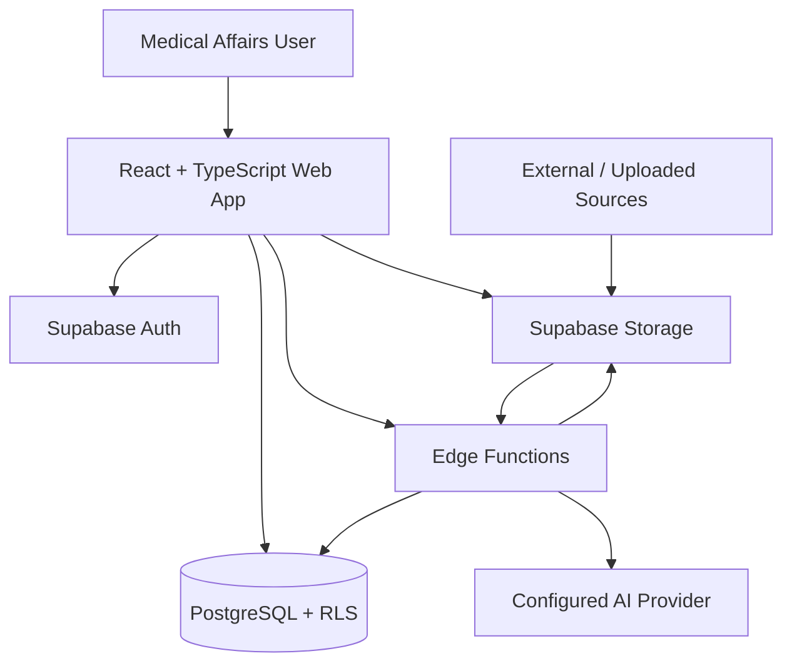

# SmartPulse Architecture Notes

## System Context

SmartPulse is a browser-based intelligence workspace for medical affairs teams. The React client is responsible for exploration and review; Supabase owns authentication, persistence, authorization, file storage, and server-side workflows.

## Frontend Boundaries

- `pages/` owns route-level workflows and composition.
- `components/` contains reusable presentation and domain interactions.
- `hooks/` is the data-access boundary. Components do not construct database queries directly unless a page-specific aggregate has no reusable domain owner yet.
- `contexts/` owns authentication, sidebar state, and cross-route alert configuration.
- `integrations/supabase/` contains the typed browser client and generated database types.
- `data/` contains synthetic fixtures used to communicate product behavior where live connectors are outside the demo scope.

TanStack Query provides server-state caching and mutation invalidation. React Context is limited to session and interface state rather than duplicating remote data.

## Intelligence Flow

1. A document, table, or external-source event enters the ingestion boundary.
2. Edge Functions validate and normalize the input before optional AI processing.
3. Structured records are persisted in PostgreSQL and linked to an HCP profile.
4. Rules interpret raw records as prioritized signals.
5. The strategy cockpit connects each alert to a recommended action.
6. Reviewers can trace a recommendation back to its trigger and supporting evidence.

## Trust Boundaries

### Browser

The browser receives only a Supabase publishable key. It must be treated as an untrusted client; UI restrictions never replace database authorization.

### Database

Row Level Security is the primary authorization layer. Migrations are versioned in source control so policy changes can be reviewed alongside application changes.

### Edge Functions

AI provider credentials, privileged database operations, input-size checks, and output normalization belong in server-side functions. Secrets must be configured in the deployment environment and must never use the `VITE_` prefix.

### Uploaded Content

Documents may contain sensitive commercial or professional information. A production deployment requires tenant isolation, file-type and size validation, malware scanning, retention controls, audit logging, and documented deletion behavior.

## Production Hardening Roadmap

- Organization tenancy and role-based access
- Policy regression tests against a local Supabase stack
- Source provenance, freshness, and connector health monitoring
- Structured AI evaluation sets and human-review thresholds
- Encryption and retention controls for uploaded content
- Audit trails for recommendation review and downstream action
- Error telemetry with sensitive-field redaction
